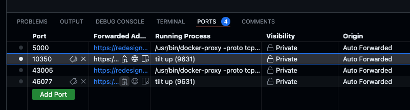

# PRISM AI Agent

An opinionated, batteries-included, ElizaOS distribution designed for ease of development and secure, scalable deployments.

## Overview

PRISM AI Agent provides a stable environment for deploying AI agents at scale, both within Trustless Engineering Co. and for customers' on-premises deployments.

Watch a quick [demo](https://app.arcade.software/share/4Bv0R5Bt6JZ4TbQWZL3n) on how to deploy using Github Codespaces!

## Key Features
- Simplified ElizaOS setup
- Isolated structure to allow custom plugins/agents
- Helm chart for deployment into any kubernetes environment
- Dev Container support

## Prerequisites

> **Note**: The default/recommended setup requires at least 16GB RAM.

### Development Environment Options

#### 1. GitHub Codespaces (Recommended)
The fastest way to get started! Choose a 64GB RAM codespace for optimal performance.

[](https://codespaces.new/prism-sh/prism-agent)

#### 2. Local Installation
Supports Linux/MacOS/Windows with the following requirements:

* [Docker Desktop](https://www.docker.com/products/docker-desktop/)
  * Make sure to enable [Kubernetes](https://docs.docker.com/desktop/features/kubernetes/) in Docker Desktop
* [CtlPtl](https://github.com/tilt-dev/ctlptl) - Local Kubernetes Cluster Controller
* [Tilt](https://docs.tilt.dev/install.html) - Local Kubernetes Development Toolkit
* [Helm](https://helm.sh/docs/intro/install/) - Kubernetes Package Manager
* [KIND](https://kind.sigs.k8s.io/) - Kubernetes-in-Docker (only needed if not using Docker Desktop)


## Getting Started

### 1. Initialize Environment
```bash
make init
```

### 2. Configure API Keys
Required configuration:
- `OPENAI_API_KEY` - Get yours [here](https://platform.openai.com/docs/overview)
- `OPENROUTER_API_KEY` (Recommended) - Get yours at [OpenRouter.ai](https://openrouter.ai/)

Add to your `.env` file:
```env
OPENAI_API_KEY=sk-...
OPENROUTER_API_KEY=sk-or-....
```

### 3. Launch Development Environment
1. Run `tilt up` in the root directory
2. Access the environment:
   - Local: https://localhost:10350/
   - Codespaces: Use the "Ports" selection
   

> **Known Issue**: On first startup, `@elizaos/adapter-postgres` may attempt to create an existing `vector` plugin. Simply restart the `prism-agent` resource using the refresh icon.

### 4. Access the Agent
Once all containers show green status, access the Agent UI at http://localhost:3800.

## Support & Community

Join our [Discord community](https://trustless.community) for support and discussions!

---

Made with ❤️ by [@wedtm](https://x.com/wedtm) and the [Trustless Engineering Co.](https://trustless.engineering/) team.
